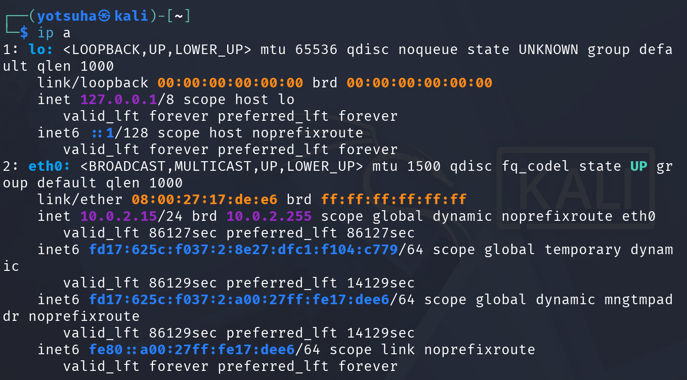
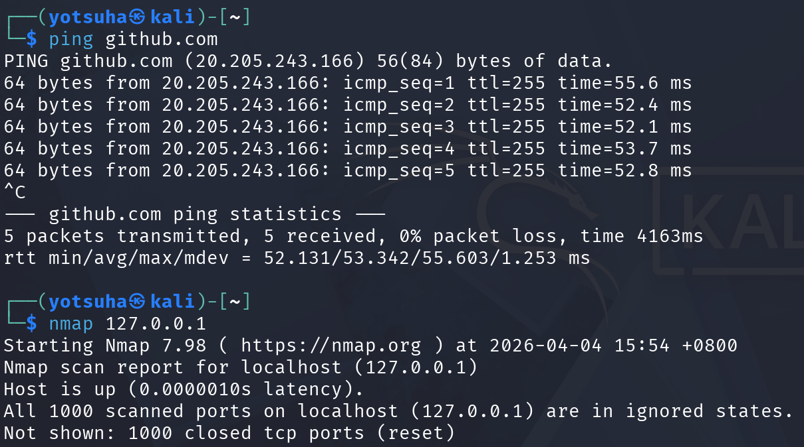

# Kali Linux - Networking Basics

## Objective
Study basic connectivity and perform initial scanning.

## Commands used
- ip a
- ping
- nmap

---

## 1. IP Address Identification
Command: ip a

Result:
- Local IP: 10.0.2.25
- Loopback Address: 127.0.0.1

---

## 2. Check Connectivity
Command: ping github.com

Result:
- 0% packet loss
- ~50 ms latency

---

## 3. Lochalhost Port Scan
Command: nmap 127.0.0.1

Result:
- All 1000 scanned ports on localhost are closed.

---

## Key Learnings:
- 127.0.0.1 refers to the loopback address/localhost
