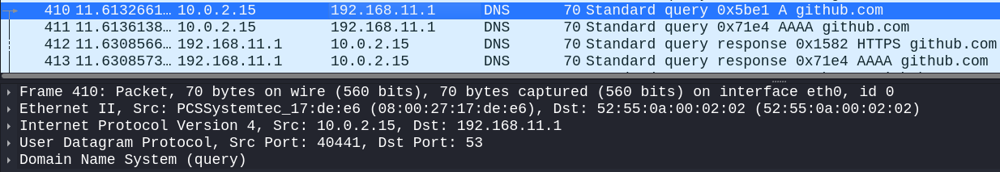
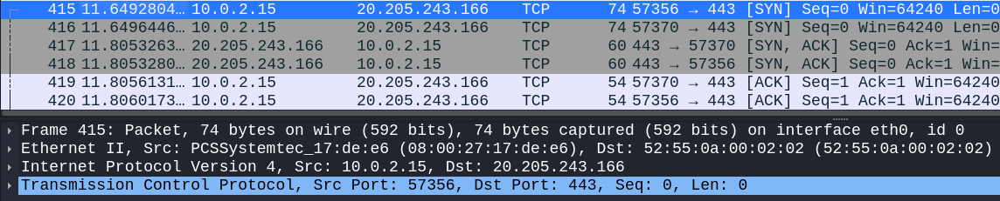

# Kali Linux - Basic Packet Analysis

## Tool 
WireShark

## Objective
Analyze real network traffic using WireShark.

## Analysis
My analysis on captured network traffic after opening GitHub website on Mozilla FireFox.

---

## 1. DNS Lookup Packets

- Two DNS Requests and Responses:
  1. A (IPv4)
  2. AAAA (IPv4)
- DNS used UDP (User Datagram Protocol)
- Request from 10.0.2.15 (my machine's IP Address) on port 40441 (high ephemeral port)
- Response from 192.168.11.1 (ISP/router)

--- 

## 2. TCP Handshake

- Two TCP three-way Handshake to the same server with different ports
- TCP three-way handshake between high ephemeral ports, 57370 and 57356, and 443 (HTTPS)
  1. SYN
  2. SYN-ACK
  3. ACK
