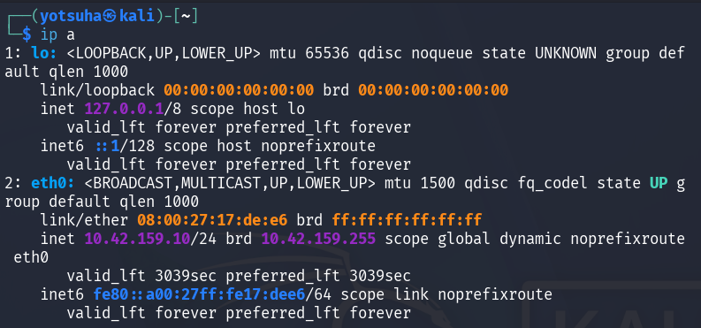
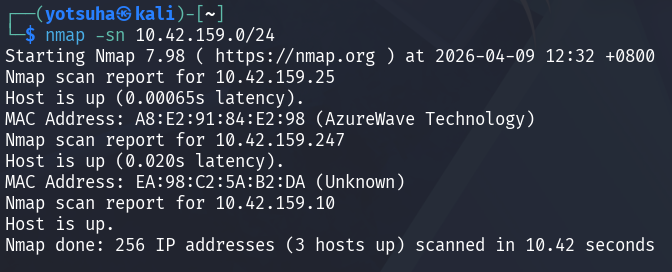
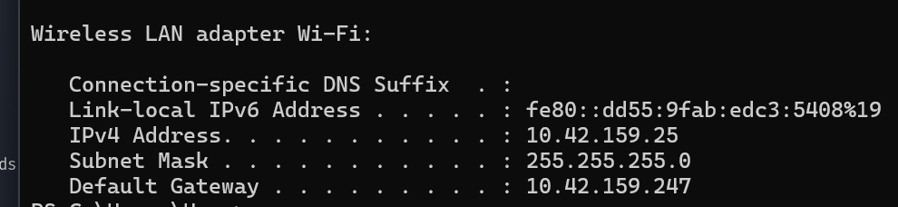
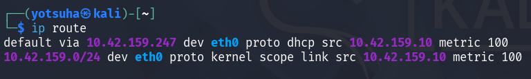

# NMAP - IP Addresses on a Network

## Operating System
Kali Linux

## Objective
Identify devices on my network.

## Commands used
- ip a
- ip route
- nmap -sn

--- 

## 1. IP Address Identification
Command: ip a

- Changed my Kali virtual machine's network adapter to **Bridged Adapter** from **NAT**.

Result:

Observations:
- Local IP: 10.42.159.10/24 (eth0)
- Network Block: 10.42.159.0 - 10.42.159.255 since /24 indicates that the network has 256 IP Addresses.

---

## 2. Check All Devices on a Network
Command: 
- nmap -sn (ping scan)
- ip route 

Result:

Observations:
- There are 3 devices on my network:
  - Laptop: 10.42.159.25
    
    
    
  - Router: 10.42.159.247
    
    
    
  - Kali Virtual Machine: 10.42.159.10
 
---

## Key Learnings
- **Bridged Adapter** connects the virtual machine to the network directly, giving it its own IP address.
- The host machine, my laptop, has a different IP address from the virtual machine.
- The command nmap -sn doesn't perform port scans, which made it useful for quick network mapping.
- Use ip route command for identifying the default gateway.
