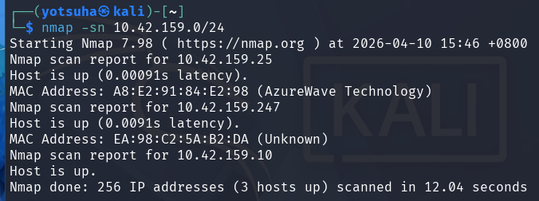
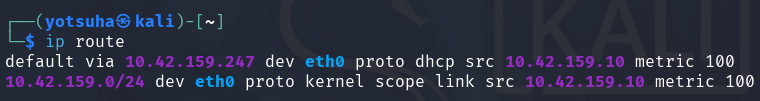
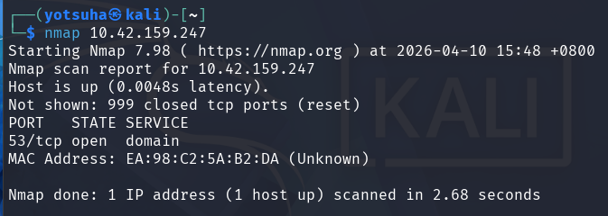
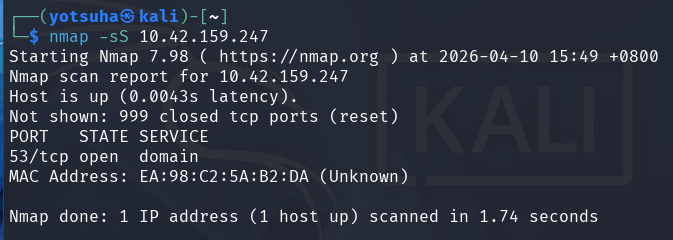
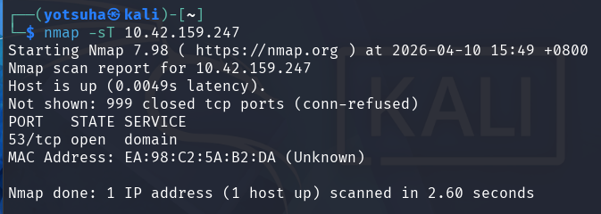

# NMAP - IP Scan

## Operating System
Kali Linux

## Objective
Scan an IP Address on my network.

## Commands Used
- ip route
- nmap -sn
- nmap
- nmap -sS
- nmap -sT
- nmap -T4

---

## 1. Scan the Network
Command: 
nmap -sn

Result: 

Observations:
- I can see the IP Addresses on my network.
- Scanned the network for 12.04 seconds.

---

## 2. Select a Target
Command: ip route

Result:

Observations:
- Router IP Address: 10.42.159.247
- Set the router as my target

---

## 3. Baseline Scan
Command: 
nmap
- defaults to nmap -sT
- sudo nmap works like nmap -sS 

Expectations: 
- will be slow
- show port 53 since it's the router

Result:

Observations:
- Port 53 open, the default port for DNS
- Scan duration: 2.68 seconds

---

## 4. Stealth Scan
Command: 
nmap -sS
- also known as **stealth scan**
- doesn't complete the TCP handshake
- isn't recorded in the target's application logs

Expectations:
- same results but faster than baseline nmap

Result: 

Observations:
- Scan duration: 1.74 seconds
- Almost a second faster than baseline scan

---

## 5. Full Scan
Command: 
nmap -sT
- completes the TCP handshake for every target
- more likely to be recorded in the target's application logs

Expectations:
- will be slower than stealth scan but the same speed as the baseline nmap
- will be much more detailed

Result:

Observations:
- conn-refused instead of reset is shown
- Scan duration: 2.60 seconds
- Same speed as the baseline scan

---

## 6. Fast Scan
Command: 
nmap -T4
- -T3 is the speed of the baseline nmap

Expectations:
- will be much faster than stealth scan

Result: 

Observations:
- Scan duration: 1.09 seconds
- Faster than all of the previous scans

--- 

Key Learnings:
- I can identify active services an IP on my network is using; for example, the router is using a DNS resolver on port 53.
- I learned that nmap changes its scanning method based on whether I use root power.
- The results are almost the same with the scan methods but they differ on time spent waiting on results.
