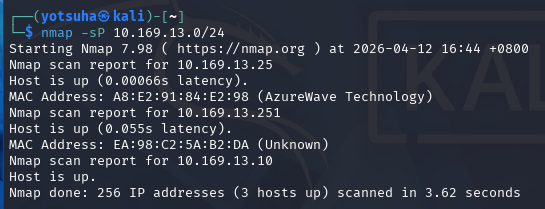
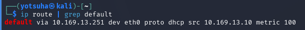
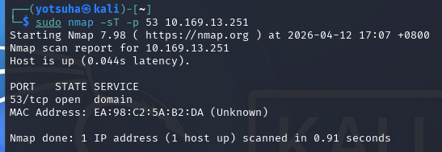
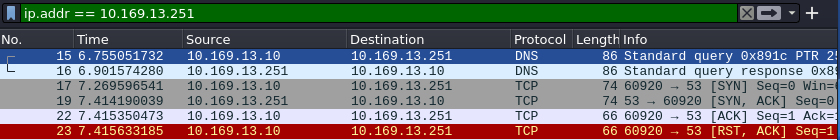
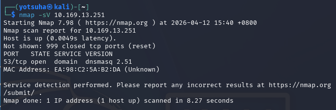
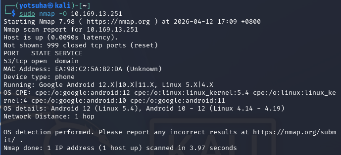
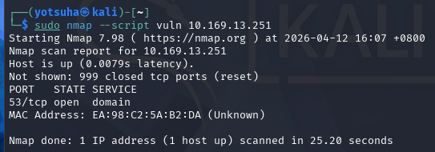
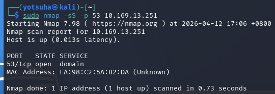
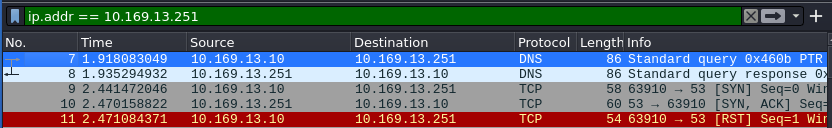

# NMAP - Further Exploration

## Operating System
Kali Linux

## Objective
Understand, perform, and analyze different nmap scans.

## Commands Used
- ip route with grep
- nmap -sP
- nmap -sT
- nmap -sS
- nmap -O
- nmap -sV
- nmap --script vuln

---

## 1. Ping Scan
Command: nmap -sP 10.169.13.0/24

- similar to nmap -sn
- scans the whole network (256 ip addresses) to find active hosts without port scan

Result:

- 3 active hosts on my network

---

## 2. Find Target
- I've decided to set my router as the target

Command: ip route | grep "default"
- search for the keyword default, which corresponds to the router's IP address

Result:

Router's IP: 10.169.13.251

---

## 3. Full Port Scan
Command: sudo nmap -sT -p 53 10.169.13.251

- Full TCP port scan with root privileges 
- -p - scan for specific port
- Detect if a specific port on a specific device is open

Result:

Wireshark Analysis:

Process:
1. Starting from No. 17, my VM sent SYN flag to my router
2. Router sends SYN-ACK, signalling that it is open
3. VM sends ACK, completing the TCP handshake
4. VM terminates the connection by sending RST-ACK

---

## 4. Version Scan
Command: nmap -sV 10.169.13.251

- scan for open ports and show the service's/application's version

Result:

- the DNS's version of my router is dnsmasq 2.51

---

## 5. OS Detection
Command: nmap -O 10.169.13.251

- detects the device and Operating System

Result:

Observations:
- Router's device: phone
  - Correct, I used my phone as a hotspot
- OS details: Android 12 (Linux 5.4)
  - I didn't expect that Samsung, or Android specifically, to be Linux-based   

---

## 6. Find Vulnerabilities
Command: sudo nmap --script vuln 10.169.13.251

- run an entire category of scripts to identify specific vulnerabilities on my router

Result:

- The script didn't find any vulnerabilities on my phone

---

## 7. Stealth Port Scan
Command: sudo nmap -sS -p 53 10.169.13.251

- Detect if port 53 (DNS default) on my router is open, without completing the TCP handshake

Result:

Wireshark Analysis:

Process:
1. Starting from No. 9, my VM sends SYN to the router
2. Router sends SYN-ACK, signalling that it is open for connection
3. VM terminates the handshake by sending RST (abrupt connection termination)
